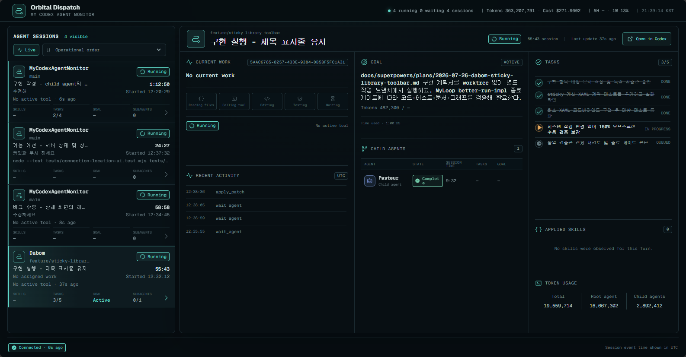
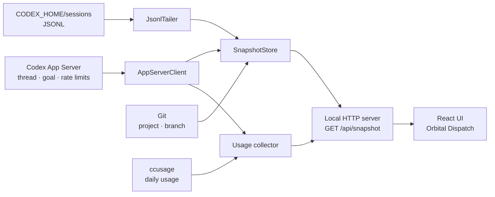

# My Codex Agent Monitor

> Windows에서 실행 중인 Codex 루트 세션과 Child Agent를 한 화면에서 추적하는 로컬 운영 대시보드

[](https://react.dev/)
[](https://vite.dev/)
[](#검증)
[](./LICENSE)

`My Codex Agent Monitor`는 Codex App Server와 로컬 세션 JSONL을 읽어 세션 상태, 현재 작업, Plan, Goal, Skills, 토큰, Child Agent를 실시간 스냅샷으로 조립합니다. 화면 안의 제품 브랜드는 **Orbital Dispatch**입니다.

## 미리보기

[](./assets/orbital-dispatch-dashboard.png)

## 주요 기능

- 루트 세션만 모아 프로젝트 폴더명, Git 브랜치, 할당 작업, 상태, 작업 시간, Skills, Plan, Goal, Child Agent 수를 표시합니다.
- 선택한 세션의 현재 작업, Live step, 최근 활동, 토큰 사용량과 Child Agent 상세를 보여줍니다.
- 사용자 확인 필요 → 실행 중 → 대기 → 계획 → 비활성 → 완료 순의 운영 기본 정렬과 열별 정렬을 지원합니다.
- Codex App Server 카탈로그와 `CODEX_HOME/sessions` JSONL을 결합해 Child Agent와 도구 활동을 증분 추적합니다.
- 오늘의 토큰·비용과 Codex 5시간/1주 사용률을 상단에서 함께 확인할 수 있습니다.
- 스냅샷 변경, Child Agent handoff, 사용량 갱신을 절제된 모션으로 표시하며 `prefers-reduced-motion`을 존중합니다.

## 빠른 시작

### 요구 사항

- Windows
- Node.js와 npm
- PATH에서 실행 가능한 `codex.cmd` 및 로그인된 Codex CLI
- Git — 현재 브랜치 표시용
- 선택 사항: `ccusage` — 오늘의 토큰과 비용 표시용

```powershell
git clone https://github.com/KindTis/MyCodexAgentMonitor.git
cd MyCodexAgentMonitor
npm ci
npm run monitor
```

`npm run monitor`는 프로덕션 빌드 후 로컬 서버를 `http://127.0.0.1:4310`에 열고 기본 브라우저를 실행합니다.

> [!IMPORTANT]
> `Live / Paused`는 화면에 새 스냅샷을 적용할지 결정할 뿐 Codex Agent의 작업을 중지하지 않습니다.

> [!NOTE]
> `ccusage`를 사용할 수 없거나 사용량 조회가 실패하면 해당 값만 `—`로 표시되고 세션 모니터링은 계속됩니다.

## 동작 구조



1. 로컬 서버가 읽기 전용 Codex App Server 프로세스를 stdio로 시작합니다.
2. `SnapshotStore`가 App Server의 Thread·Goal과 JSONL 증분 이벤트를 3초마다 합칩니다.
3. 사용량 수집기가 `ccusage`와 App Server rate limit을 10초마다 독립적으로 조회합니다.
4. React UI가 `/api/snapshot`을 3초마다 폴링해 목록과 선택 세션 상세를 갱신합니다.

## 화면에 표시되는 정보

| 영역 | 내용 |
| --- | --- |
| 루트 세션 목록 | 프로젝트, 브랜치, 세션/할당 작업, 상태/현재 활동, 작업 시간, Skills, Plan, Goal, 활성/전체 Child Agent |
| 선택 세션 상세 | 현재 작업, Live step, 최근 활동, Goal, Plan Tasks, 적용 Skills, 토큰, Child Agents |
| Child Agent dialog | 현재 작업, 최근 활동, 적용 Skills, Tasks, Goal |
| 상단 요약 | 실행/대기/전체 세션, 오늘 토큰·비용, 5시간/1주 사용률, 로컬 시각 |
| 하단 상태 | 스냅샷 연결 상태와 마지막 정상 갱신 이후 경과 시간 |

### 상태 판정

| 상태 | 주요 근거 |
| --- | --- |
| `Needs input` | 사용자 입력·승인 대기 |
| `Waiting` | `wait` 또는 `wait_agent` 호출 |
| `Planning` | 진행 중인 `update_plan` 호출 |
| `Running` | 진행 중인 도구 호출 또는 관찰된 Turn |
| `Idle` | 최근 활동이 10분 이상 없음 |
| 완료 상태 | `Complete`, `Failed`, `Cancelled`, `Stopped` 이벤트 |

직접 관찰할 수 없는 App Server 상태나 시간 기반 상태에는 화면에 `추정` 표시가 붙습니다. 세션 시간은 루트 Agent의 누적 작업 시간이며 사용자·승인·Child Agent 대기를 제외합니다. Live 연결 상태에서 실제 작업 중인 세션만 스냅샷 사이 시간을 보간합니다.

## 명령어

| 명령 | 설명 |
| --- | --- |
| `npm run monitor` | 빌드 후 실제 로컬 스냅샷 서버와 브라우저 실행 |
| `npm run dev` | Vite UI 개발 서버 실행; `/api/snapshot`은 제공하지 않음 |
| `npm run build` | `dist/client` 빌드 및 Sites 패키징 파일 준비 |
| `npm run preview` | 빌드된 정적 UI 미리보기 |
| `npm test` | 전체 Node.js 테스트 실행 |
| `npm run test:sites` | Sites Worker와 패키징 계약 테스트 |

## 프로젝트 구조

```text
src/
├─ App.jsx                 # 세션 목록, 상세 화면, 폴링과 Live/Paused 상태
├─ agent-model.js          # 상태 정규화, 정렬, 시간·변경 계산
└─ styles.css              # 데스크톱 master-detail 및 반응형 UI
monitor/
├─ app-server-client.mjs   # 읽기 전용 Codex App Server 클라이언트
├─ session-log.mjs         # JSONL 증분 읽기와 Turn 상태 환원
├─ snapshot-store.mjs      # Thread·Goal·JSONL·Git 데이터 결합
├─ usage.mjs               # 오늘 사용량과 rate limit 수집
└─ server.mjs              # 로컬 정적 파일 및 snapshot API 서버
tests/                     # 모델, 수집기, 서버, UI 계약 테스트
worker/index.js            # Sites 정적 자산 및 SPA fallback Worker
scripts/prepare-sites-build.mjs
```

## 안전 경계

- 서버는 `127.0.0.1`에만 바인딩합니다.
- App Server 호출은 Thread·Goal·rate limit 읽기 메서드로 제한합니다.
- JSONL은 `CODEX_HOME` 내부 경로만 읽으며 스냅샷은 `no-store`로 제공합니다.
- App Server 장애 시 1초, 2초, 4초, 5초 간격으로 재연결하고 연결 상태를 화면에 노출합니다.

## 현재 제약

- 프로세스 실행과 종료가 `cmd.exe`, `codex.cmd`, `taskkill.exe`를 사용하므로 현재 런타임은 Windows 전용입니다.
- Sites Worker와 `npm run dev`는 정적 UI만 제공합니다. 실제 Codex 데이터는 로컬 `npm run monitor` 서버가 있어야 합니다.
- Codex App Server의 experimental API 계약이 바뀌면 클라이언트 갱신이 필요할 수 있습니다.

## 검증

```powershell
npm test
npm run build
npm run test:sites
```

테스트는 App Server 프로토콜, JSONL 경계와 증분 처리, 세션 상태·시간·정렬, Child Agent 발견, 장애 복구, 사용량 수집, UI·레이아웃 계약과 Sites 패키징을 검증합니다.

## 라이선스

[MIT License](./LICENSE) © 2026 Kiheon, Park
